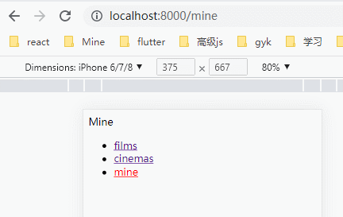
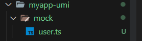

## 整合了 React 全家桶的 [umi4 脚手架](https://umijs.org/docs)，路由是 react-router-dom@6，React 是@18

### 1. 创建项目

```bash
npx create-umi@latest
```

### 2. 路由

- 配置式路由

```ts
routes: [
  { path: "/", component: "index" },
  { path: "/docs", component: "docs" },
],
```

- 约定式路由：注释.umirc.ts 中配置 routers

  - 一级路由：在 pages 下新建文件，路由约定式生成
    <br/>
    
    

  - 嵌套路由：使用<Outlet/>容器组件，在同目录新建一个 Films 文件夹，放嵌套路由文件

    ```tsx
    // Films.tsx
    import React, { useEffect } from 'react';
    import { Outlet } from 'umi';

    export default function Films() {
      return (
        <div>
          <div style={{ height: '200px' }}>大轮播</div>
          {/* 嵌套路由 */}
          <Outlet />
        </div>
      );
    }
    ```

    

  - 路由重定向：useNavigate 钩子跳转或者<Navigate />

  ```tsx
  // Films.tsx
  import React, { useEffect } from 'react';
  import { Outlet, useLocation, useNavigate } from 'umi';

  export default function Films() {
    const location = useLocation();
    const navigate = useNavigate();
    useEffect(() => {
      if (location.pathname === '/films') {
        // 重定向到NowPlaying页面
        navigate('/films/nowplaying');
      }
    }, []);

    return (
      <div>
        <div style={{ height: '200px' }}>大轮播</div>
        {/* 嵌套路由 */}
        <Outlet />
      </div>
    );
  }
  ```

  - 404 路由：在 pages 下新建 404.tsx，所有匹配不到 pages 下面文件的路由都会默认走 404

  - 声明式导航 ：<NavLink/>

  ```tsx
  import { NavLink, Outlet } from 'umi';
  import styles from './index.less';

  export default function Layout() {
    return (
      <div className={styles.navs}>
        {/* 嵌套路由容器 */}
        <Outlet />
        <ul>
          {['films', 'cinemas', 'mine'].map((item, index) => {
            return (
              <li key={index}>
                <NavLink
                  to={`/${item}`}
                  className={({ isActive }) =>
                    isActive ? styles.active : undefined
                  }
                >
                  {item}
                </NavLink>
              </li>
            );
          })}
        </ul>
      </div>
    );
  }
  ```

  ```less
  .navs {
    .active {
      color: red;
    }
  }
  ```

  - 编程式导航：useNavigate

  ```tsx
  import { useNavigate } from 'umi';
  const navigate = useNavigate();
  navigate(`/detail/${item.filmId}`, { replace: true });
  ```

  - 动态路由：\$id，获取就是 id
    <br/>
    

  ```tsx
  import { useParams } from 'umi';
  const params = useParams();
  ```

  - 路由拦截：Router6 中路由拦截，hooks 组件可以直接使用 useNavigate 钩子函数，class 组件可以自己封装一个 withRouter 高阶组件

  ```tsx
  // Mine.tsx
  import withRouter from '@/components/withRouter';
  import React, { useEffect } from 'react';
  import { useNavigate } from 'umi';

  function Mine(props: any) {
    console.log(props, 'props');

    // 路由拦截方式一：用于hooks组件
    const navigate = useNavigate();
    useEffect(() => {
      if (!localStorage.getItem('token')) {
        navigate('/login');
      }
    }, []);

    return <div>Mine</div>;
  }
  export default Mine;

  // 路由拦截方式二：用于class组件
  // export default withRouter(Mine);

  // withRouter.tsx
  import React from 'react';
  import { Navigate } from 'umi';

  // 封装一个高阶组件做路由拦截
  export default function withRouter(Componnet: any) {
    return function (props: any) {
      return localStorage.getItem('token') ? (
        <Componnet a="1" {...props} />
      ) : (
        <Navigate to="/login" />
      );
    };
  }
  ```

  - 路由模式配置：在.umirc.ts 中配置，hash 路由是利用锚点，browser 路由是利用 location.href 属性，browser 路由需要后端配合，如果遇到没有处理请求的路径，转发回给前端 index.html 页面

  ```ts
   history: {
    type: 'hash', // "browser"
  },
  ```

### 3. Mock



### 4. 反向代理

### 5. 组件库集成

```bash
npm i antd-mobile -S
```

### 6. dva 集成了 Redux：怎么 connect 上 redux store 啊

- 同步更新 model，获取 model

- 异步更新 model，

### FAQ：umi3 升级到 umi4：

- umi4 中怎么路由拦截啊，wrappers 不生效：useNavigate
- umi4 中没有 dva，怎么跟 model 连接
